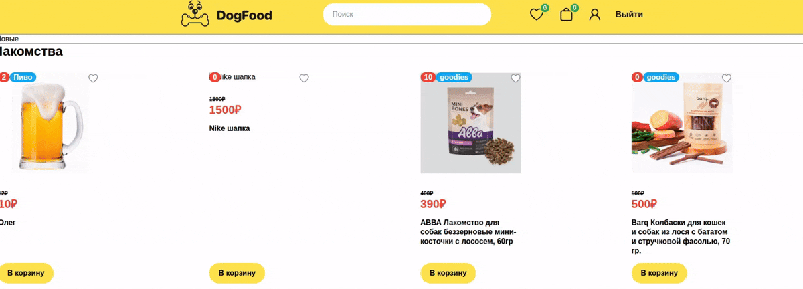
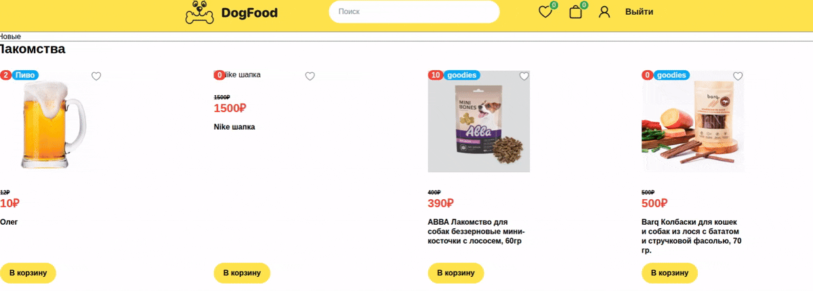
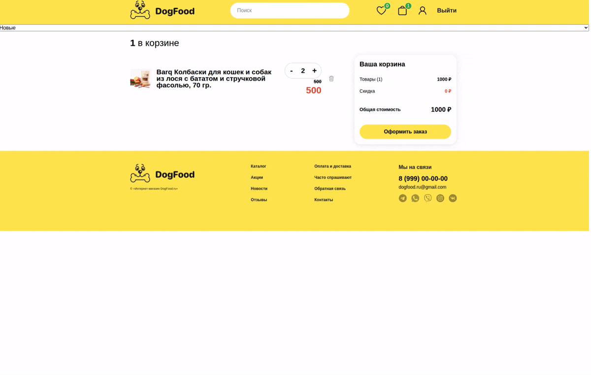
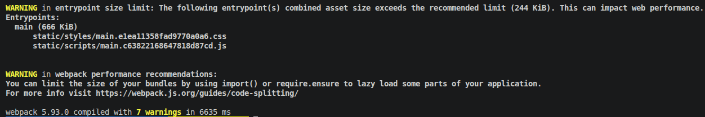
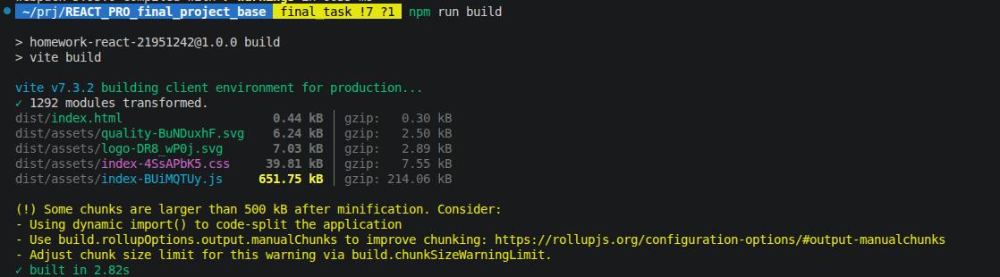

# React Pro Final Project Base

## Задание 1 Архитектура:

### Что сделано:

- создан компонент Button в shared;
- создан компонент Input в shared;
- создана/перенесена корзина (cart) в features;
- создана/перенесена авторизация (api, SignIn, SignUp) в features;
- создана/перенесен search в features;
- создана/перенесен sort в features;
- перенесен store в папку app;
- перенесен providers в папку app;

## Задание 2 ОПТИМИЗАЦИЯ:

### Что сделано:

- найдены и убраны дубли ререндеров при добавлении в корзину в списке товаров;
- найдены и убраны дубли ререндеров при добавлении в избранное в списке товаров;
- использован useMemo для сложных вычислений (useCount и др);

ДДобавление в корзину + счетчик товаров + лайк до оптимизации:


Добавление в корзину + счетчик товаров + лайк после оптимизации:


## Задание 3 REACT PORTAL:

### Что сделано:

- Добавлен confirm dialog через модалку при подтверждении заказа из корзины;



## Задание 4 USEREF:

### Что сделано:

- автофокус на крестик в модалке и на предыдущий тригер элемент на странице при закрытии модалки;
- автофокус на поле email на странице авторизации;

## Задание 5 Сборка:

### Что сделано:

- Сборка vite с SWC;

- Время сборок

Время Vite - 2.82
Время Webpack - 6.64 с
Вывод - Vite (в 2.35x быстрее)





## Задание 6 React 19 Hooks:

### Что сделано:

- Реализовано оптимистичное добавление товара в избранное (лайк) с помощью хука useOptimistic

## Структура проекта

```
react_pro_final_project_base/
├── .env
├── .eslintignore
├── .eslintrc.js
├── .gitignore
├── .husky/
├── .prettierignore
├── .prettierrc.js
├── .stylelintignore
├── .stylelintrc.json
├── index.html
├── package-lock.json
├── package.json
├── postcss.config.js
├── README.md
├── tsconfig.json
├── tsconfig.app.json
├── tsconfig.node.json
├── vite.config.ts
└── src/
├── custom.d.ts
├── index.tsx
├── app/
│ ├── App.tsx
│ ├── app.module.css
│ ├── index.ts
│ ├── providers/
│ │ └── router/
│ │ ├── index.ts
│ │ └── config/
│ │ └── router.tsx
│ └── store/
│ ├── HOCs/
│ │ ├── WithProtection.tsx
│ │ └── WithQuery.tsx
│ ├── api/
│ │ ├── config.ts
│ │ └── productsApi.ts
│ ├── hooks/
│ │ └── useProducts.ts
│ ├── reducers/
│ │ └── rootReducer.ts
│ ├── slices/
│ │ ├── cart.ts
│ │ ├── products.ts
│ │ └── user.ts
│ ├── store.ts
│ ├── types.ts
│ └── utils.ts
├── entities/
│ └── Card/
│ ├── index.ts
│ └── ui/
│ ├── Card.module.css
│ ├── Card.tsx
│ └── Price/
│ └── ui/
│ ├── Price.module.css
│ └── Price.tsx
├── features/
│ ├── auth/
│ │ ├── api/
│ │ │ └── authApi.ts
│ │ ├── sign-up/
│ │ │ ├── model/
│ │ │ │ ├── types.ts
│ │ │ │ └── validator.ts
│ │ │ └── ui/
│ │ │ └── SignUpForm.tsx
│ │ └── sing-in/
│ │ ├── model/
│ │ │ ├── types.ts
│ │ │ └── validator.ts
│ │ └── ui/
│ │ └── SignInForm.tsx
│ ├── cart/
│ │ ├── hooks/
│ │ │ ├── useAddToCart.ts
│ │ │ └── useCount.ts
│ │ ├── product-cart-counter/
│ │ │ ├── hooks/
│ │ │ │ └── useCount.ts
│ │ │ ├── index.ts
│ │ │ └── ui/
│ │ │ ├── ProductCartCounter.module.css
│ │ │ └── ProductCartCounter.tsx
│ │ └── ui/
│ │ ├── CartCounter.module.css
│ │ └── CartCounter.tsx
│ ├── like-button/
│ │ ├── index.ts
│ │ └── ui/
│ │ ├── LikeButton.module.css
│ │ └── LikeButton.tsx
│ ├── load-more/
│ │ ├── hooks/
│ │ │ └── useLoadMore.ts
│ │ ├── index.ts
│ │ └── ui/
│ │ └── LoadMore.tsx
│ ├── search/
│ │ ├── hooks/
│ │ │ └── usePostsSearchForm.ts
│ │ ├── index.ts
│ │ └── ui/
│ │ ├── Search.module.css
│ │ └── Search.tsx
│ └── sort/
│ ├── hooks/
│ │ └── useSort.ts
│ ├── index.ts
│ └── ui/
│ └── Sort.tsx
├── pages/
│ ├── CartPage/
│ │ ├── index.ts
│ │ └── ui/
│ │ ├── CartPage.module.css
│ │ └── CartPage.tsx
│ ├── FavoritesPage/
│ │ ├── index.ts
│ │ └── ui/
│ │ └── FavoritesPage.tsx
│ ├── HomePage/
│ │ ├── index.ts
│ │ └── ui/
│ │ └── HomePage.tsx
│ ├── NotFoundPage/
│ │ ├── index.ts
│ │ └── ui/
│ │ ├── NotFoudPage.module.css
│ │ └── NotFoundPage.tsx
│ ├── ProductPage/
│ │ ├── index.ts
│ │ └── ui/
│ │ ├── ProductPage.module.css
│ │ └── ProductPage.tsx
│ ├── ProfilePage/
│ │ ├── index.ts
│ │ └── ui/
│ │ ├── ProfilePage.module.css
│ │ └── ProfilePage.tsx
│ ├── SignInPage/
│ │ ├── index.ts
│ │ └── ui/
│ │ └── SignInPage.tsx
│ └── SignUpPage/
│ ├── index.ts
│ └── ui/
│ └── SignUpPage.tsx
├── shared/
│ ├── api/
│ │ ├── ApiServise.ts
│ │ ├── baseApi.ts
│ │ └── hooks/
│ │ └── useActionCreated.ts
│ ├── assets/
│ │ ├── icons/
│ │ │ ├── back.svg
│ │ │ ├── like.svg
│ │ │ ├── quality.svg
│ │ │ ├── star.svg
│ │ │ ├── trash.svg
│ │ │ └── truck.svg
│ │ └── images/
│ │ ├── instagram.svg
│ │ ├── telegram.svg
│ │ ├── viber.svg
│ │ ├── vk.svg
│ │ └── whatsapp.svg
│ ├── hooks/
│ │ ├── useDebounce.ts
│ │ └── usePagination.ts
│ ├── types/
│ │ └── global.d.ts
│ ├── ui/
│ │ ├── Button/
│ │ │ ├── index.ts
│ │ │ └── ui/
│ │ │ ├── Button.module.css
│ │ │ └── Button.tsx
│ │ ├── ButtonBack/
│ │ │ ├── index.ts
│ │ │ └── ui/
│ │ │ └── ButtonBack.tsx
│ │ ├── ConfirmDialog/
│ │ │ ├── ConfirmDialog.tsx
│ │ │ ├── createConfirmContainer.ts
│ │ │ └── useConfirmDialog.ts
│ │ ├── Input/
│ │ │ ├── index.ts
│ │ │ └── ui/
│ │ │ ├── Input.module.css
│ │ │ └── Input.tsx
│ │ ├── Logo/
│ │ │ ├── index.ts
│ │ │ ├── assets/
│ │ │ │ └── logo.svg
│ │ │ ├── ui/
│ │ │ │ ├── Logo.module.css
│ │ │ │ └── Logo.tsx
│ │ ├── Modal/
│ │ │ ├── getModalRoot.ts
│ │ │ └── ui/
│ │ │ ├── Modal.module.css
│ │ │ └── Modal.tsx
│ │ ├── Rating/
│ │ │ ├── index.ts
│ │ │ └── ui/
│ │ │ └── Rating.tsx
│ │ ├── Spinner/
│ │ │ ├── index.ts
│ │ │ └── ui/
│ │ │ ├── Spinner.module.css
│ │ │ └── Spinner.tsx
│ ├── utils/
│ │ ├── common.ts
│ │ ├── getMessageFromError.ts
│ │ ├── index.ts
│ │ └── isLiked.ts
└── widgets/
├── CardList/
│ ├── index.ts
│ └── ui/
│ ├── CardList.module.css
│ └── CardList.tsx
├── Footer/
│ ├── index.ts
│ └── ui/
│ ├── Footer.module.css
│ └── Footer.tsx
├── Header/
│ ├── index.ts
│ └── ui/
│ ├── Header.module.css
│ └── Header.tsx
└── ReviewList/
├── index.ts
└── ui/
├── ReviewList.module.css
├── ReviewList.tsx
└── ReviewForm/
├── ReviewForm.module.css
└── ReviewForm.tsx
```
